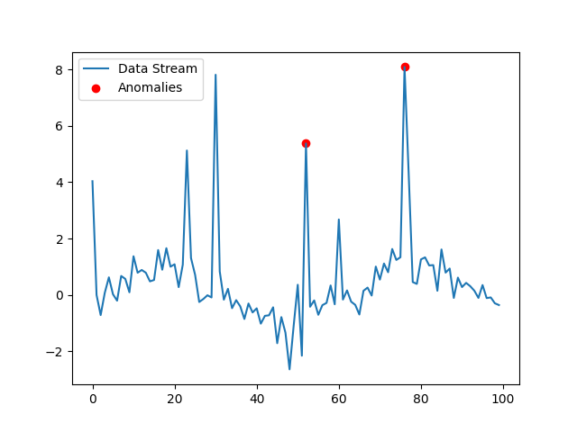

# Anomaly Detection in Data Streams

This project implements an efficient real-time anomaly detection algorithm for continuous data streams using Python. The data stream could represent various metrics such as financial transactions or system metrics, with the goal of identifying unusual patterns (anomalies) such as exceptionally high values or significant deviations from the norm.

## Table of Contents
- [Overview](#overview)
- [Algorithm](#algorithm)
- [Features](#features)
- [Requirements](#requirements)
- [Installation](#installation)
- [Visualization](#visualization)

## Overview
This project aims to detect anomalies in real-time data streams while optimizing for speed and efficiency. The system uses a custom data generator that simulates regular patterns, seasonal variations, and random noise. Anomalies are flagged based on deviations from expected behavior.

## Algorithm
The anomaly detection algorithm uses a simple statistical model (e.g., Z-score or rolling mean) to detect anomalies. The algorithm adapts to changing data patterns (concept drift) and handles seasonality.

### Key Objectives:
- **Algorithm Selection**: Adaptable to concept drift and seasonal variations.
- **Data Stream Simulation**: Realistic patterns with noise.
- **Anomaly Detection**: Real-time identification of anomalies.
- **Optimization**: Fast and efficient processing.
- **Visualization**: Real-time plot of the data stream and detected anomalies.

## Features
- Simulates a continuous data stream with regular patterns and random noise.
- Detects anomalies in real-time using a lightweight statistical algorithm.
- Provides a clear visualization of data streams and anomalies.
- Can display interactive plots for visualization.

## Requirements
The project is implemented in Python 3.x and requires the following libraries:

- `matplotlib`
- `numpy`

## Installation

1. **Clone the repository**:
   ```bash
   git clone https://github.com/Cebonkosi/AnomalyDetection.git
   cd AnomalyDetection

## Visualization

This plot illustrates the data stream generated by the anomaly detection algorithm. The red points represent the detected anomalies, while the blue line shows the normal data stream.

